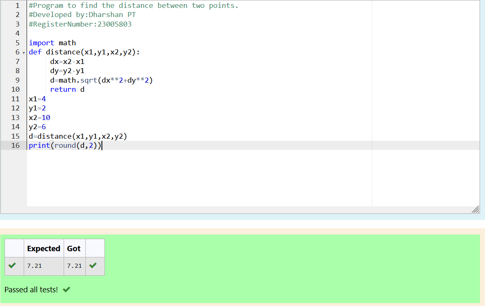

# DISTANCE-BETWEEN-TWO-POINTS

## AIM:
To write a python program to find the distance two 2 points
## ALGORITHM:
### Step 1: 
Clone the repository from the github
### Step 2: 
Assign the value of second variable to a temporary variable
### Step 3:
Substitute the values in the distance formula  
### Step 4:
Print the round(d,2)
### Step 5:
End the program
### PROGRAM:
```
#Program to find the distance between two points.
#Developed by:Dharshan PT
#RegisterNumber:23005803

import math
def distance(x1,y1,x2,y2):
     dx=x2-x1
     dy=y2-y1
     d=math.sqrt(dx**2+dy**2)
     return d
x1=4
y1=2
x2=10
y2=6
d=distance(x1,y1,x2,y2)
print(round(d,2))
```  


### OUTPUT:


### RESULT:
Thus the circulate n variable is completed successfully